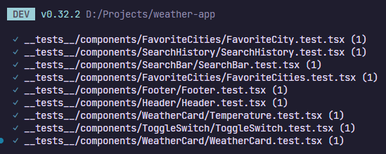
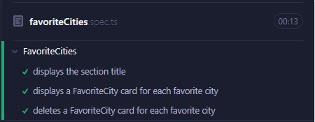
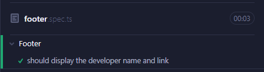
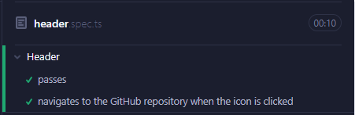
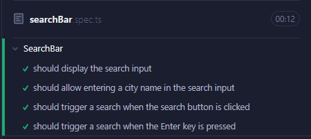
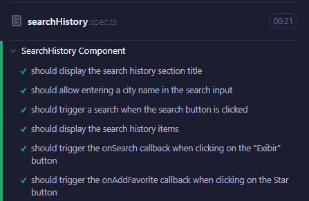
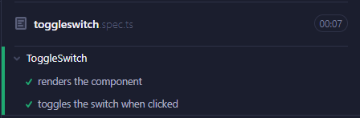
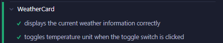

# Weather App

O Weather App é um aplicativo web que fornece aos usuários informações meteorológicas atualizadas para diferentes cidades. Os usuários podem pesquisar por uma cidade específica, visualizar os detalhes do clima e adicionar cidades aos favoritos para acesso rápido.

<p align="center">
   <a href="https://www.linkedin.com/in/filipefmotta/">
      
   </a>

  <a aria-label="Last Commit" href="https://github.com/filipefdm/weather-app/commits/master">
    
  </a>
</p>

## Sumário

- [Recursos](#recursos)
- [Tecnologias](#tecnologias)
- [Primeiros Passos](#primeiros-passos)
- [Utilização](#utilização)
- [Contribuição](#contribuição)

## Recursos

- Pesquisar informações meteorológicas de uma cidade específica.
- Visualizar detalhes do clima atual, incluindo temperatura, umidade, velocidade do vento e condições climáticas.
- Adicionar cidades aos favoritos para acesso rápido.
- Alternar entre unidades de temperatura Celsius e Fahrenheit.

## Tecnologias

O Weather App é desenvolvido utilizando as seguintes tecnologias:

- React: Biblioteca JavaScript para construção de interfaces de usuário.
- Redux: Biblioteca de gerenciamento de estado para controle do estado da aplicação.
- Next.js: Framework React para renderização no servidor e construção de aplicações web.
- Material-UI: Biblioteca de componentes de interface do usuário para criação de interfaces responsivas e visualmente agradáveis.
- Axios: Cliente HTTP para realizar requisições à API.
- OpenWeatherMap API: API provedora de dados meteorológicos para obtenção de informações do clima.

## Primeiros Passos

Para começar com o Weather Forecast App, siga os seguintes passos:

1. Clone o repositório:

   ```bash
   git clone https://github.com/filipefdm/weather-app.git
   ```

2. Acesse o diretório do projeto:

   ```bash
   cd weather-app
   ```

3. Instale as dependências:

   ```bash
   npm install
   ```

4. Crie um arquivo `.env` na raiz do projeto e adicione as seguintes variáveis de ambiente:

   ```
   NEXT_PUBLIC_API_BASE_URL=<URL base da API do OpenWeatherMap>
   NEXT_PUBLIC_API_KEY=<Chave de API do OpenWeatherMap>
   ```

   Substitua `<URL base da API do OpenWeatherMap>` e `<Chave de API do OpenWeatherMap>` pelas suas credenciais da API do OpenWeatherMap.

5. Inicie o servidor de desenvolvimento:

   ```bash
   npm run dev
   ```

6. Abra o navegador e acesse `http://localhost:3000` para utilizar o Weather Forecast App.

## Utilização

- Digite o nome de uma cidade na barra de pesquisa para buscar informações meteorológicas.
- Clique em uma cidade nos resultados da pesquisa para visualizar os detalhes do clima atual.
- Use o botão de alternância de unidade de temperatura para mudar entre Celsius e Fahrenheit.
- Clique no botão "☆" para adicionar uma cidade aos favoritos.
- Clique em uma cidade favorita na lista de favoritos para ver os detalhes do clima.
- Remova uma cidade dos favoritos clicando no botão "🗑".

## Contribuição

Contribuições são bem-vindas! Se você deseja contribuir para o Weather App, siga estas etapas:

1. Faça um fork do repositório.
2. Crie um novo branch para sua funcionalidade ou correção de bug.
3. Faça as alterações necessárias e faça commit do seu código.
4. Envie suas alterações para o seu fork.
5. Envie um pull request.

## Testes

Foram implementados os seguintes testes para garantir a qualidade e integridade do aplicativo:

### Testes Unitários



### Testes de Integração (E2E)

Foram implementados testes de integração para garantir o correto funcionamento das principais funcionalidades do Weather App. Esses testes abrangem múltiplos componentes e interações, garantindo a estabilidade e a usabilidade do aplicativo em diferentes cenários.

Para executar os testes de integração, siga os seguintes passos:

1. Certifique-se de que o servidor de desenvolvimento esteja em execução:

```bash
npm run dev
```

2. Em outro terminal, execute os testes de integração:

```bash
npm run cypress:open
```








---

Feito com 💜 por [Filipe Motta](https://github.com/filipefdm) 😊
